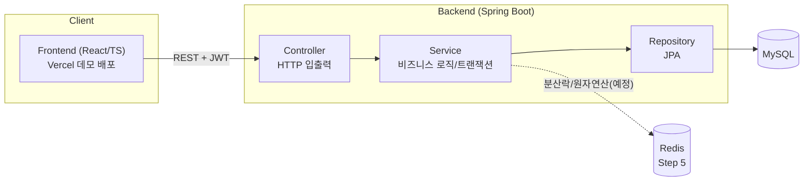
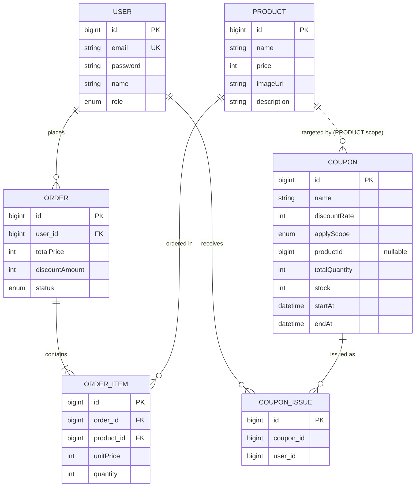
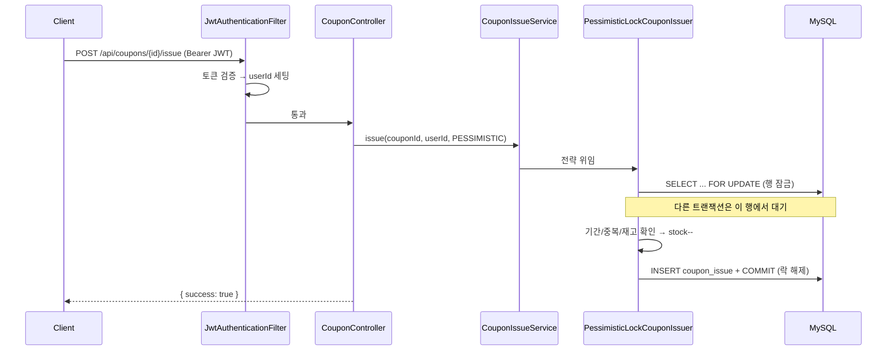

# 🏗 아키텍처 & 프로젝트 총정리

이 문서는 지금까지 만든 것을 한눈에 파악하기 위한 정리본입니다.
(시스템 구조 · ERD · 도메인 · **핵심(동시성 제어)** · 요청 흐름 · API · 개발 이력)

---

## 1. 프로젝트 개요

**Burger Coupon Rush** — 버거 주문 서비스에 **"선착순 쿠폰 발급"**을 얹은 프로젝트.
메뉴/주문 같은 일반 CRUD는 실용적으로, **핵심인 "선착순 쿠폰 발급의 동시성 제어"는 깊이 있게** 다루는 것이 목표.

> 한 줄 문제의식: **"쿠폰 100장을 1000명이 동시에 받으려 할 때, 어떻게 정확히 100장만 발급할 것인가?"**

---

## 2. 기술 스택

| 영역 | 스택 |
|---|---|
| Backend | Spring Boot 3.3, Java 17, Spring Data JPA, Spring Security + JWT |
| DB | MySQL 8 (로컬 Docker Compose · H2는 test/demo) |
| 캐시/락 | Redis 7 (Redisson) — *Step 5 예정* |
| Frontend | React 18 + TypeScript + Vite + Tailwind CSS |
| 부하테스트 | k6 — *Step 6 예정* |
| 인프라 | Docker Compose, Vercel(프론트 데모 배포) |

---

## 3. 시스템 아키텍처

모노레포. 프론트/백엔드/부하테스트가 한 저장소에 있고 폴더로 분리.



**폴더 구조**
```
burger-coupon-rush/
├── backend/     # Spring Boot (Controller-Service-Repository-Entity-DTO)
├── frontend/    # React + TS + Tailwind (데모 모드 mock 포함)
├── loadtest/    # k6 (예정)
├── docs/        # 이 문서 등
└── docker-compose.yml
```

---

## 4. 백엔드 계층 구조

각 계층은 **한 가지 역할**만 담당한다.

| 계층 | 역할 |
|---|---|
| **Controller** | HTTP 요청 수신/응답 (`ApiResponse`로 포맷 통일) |
| **Service** | 비즈니스 로직 + `@Transactional` |
| **Repository** | JPA 데이터 접근 (SQL 자동 생성) |
| **Entity** | DB 테이블 매핑 + 도메인 로직 |
| **DTO** | 계층 경계에서 주고받는 데이터 (요청/응답 전용) |

**패키지 (도메인별 구성)**
```
com.d5wq.burger
├── common      # ApiResponse, ErrorCode/BusinessException/GlobalExceptionHandler, BaseTimeEntity, init(시드)
├── config      # SecurityConfig, WebConfig
├── security    # JwtTokenProvider, JwtAuthenticationFilter, @LoginUser
├── user        # 회원/인증
├── product     # 상품(버거)
├── order        # 주문
└── coupon      # 쿠폰(선착순 발급 + 동시성 제어) ⭐
```

---

## 5. ERD



> `COUPON_ISSUE`는 `(coupon_id, user_id)` **유니크 제약**으로 "1인 1장"을 DB 레벨에서 보장한다.
> `COUPON.productId`는 `applyScope=PRODUCT`일 때 대상 상품을 가리키는 논리적 참조.

---

## 6. 도메인 요약

- **User** — 회원가입/로그인(JWT 발급), 비밀번호 BCrypt. `@LoginUser`로 컨트롤러에 userId 주입.
- **Product** — 버거 메뉴(시드 8종). 조회 API.
- **Order / OrderItem** — 장바구니 없이 메뉴+수량 → 바로 주문. 주문 시점 단가 스냅샷, 합계 계산.
- **Coupon / CouponIssue** ⭐ — 선착순 발급. 버거별/전체 범위(`applyScope`)로 할인율 다르게. **동시성 제어가 핵심.**

---

## 7. ⭐ 핵심: 선착순 쿠폰 발급의 동시성 제어

### 문제 — "확인 후 차감"은 원자적이지 않다
```
① 재고 읽기 → ③ stock > 0 확인 → ④ stock-- → ⑤ 발급
```
여러 스레드가 ①에서 **동시에 같은 재고를 읽으면** 모두 ③을 통과 → **초과 발급**.

### 3단계 접근 (진행 상황)

| 방식 | 설명 | 초과 발급 | 상태 |
|---|---|---|---|
| **naive** | 락 없음 | 재고 100 → **~968장 발급 (초과 +868)** 🐛 | ✅ 재현 |
| **비관적 락** | `@Lock(PESSIMISTIC_WRITE)` = `SELECT ... FOR UPDATE` | **0** ✅ | ✅ 해결 |
| **Redis** | Redisson 분산락/원자연산 | 0 (처리량↑ 목표) | ⏳ Step 5 |

> **측정(재고 100 · 동시 1000요청, H2 통합 테스트)**
> - naive: 발급 **968장** (재고 카운터는 0이지만 실제 발급 내역은 968행 → 초과 868)
> - 비관적 락: 발급 **정확히 100장**, 초과 0

**왜 naive에서 재고가 음수가 아니라 0인가?**
JPA 변경 감지는 커밋 시 `stock = 읽은값 - 1`(절대값)로 UPDATE → 동시에 같은 값을 읽은 트랜잭션들의 차감이 서로 덮어써짐(lost update). `stock>0`을 통과한 스레드만 저장하므로 최소 저장값이 0 → **음수 없이 0에서 바닥, 초과분은 발급 내역 행 수로 드러난다.**

**비관적 락이 해결하는 방식**
락을 잡은 트랜잭션이 커밋할 때까지 다른 트랜잭션은 같은 행을 읽지 못하고 대기 → "읽기~차감~커밋"이 **한 번에 하나씩 직렬화** → 겹칠 수 없음.

**왜 Redis까지 가나 (Step 5 이유)**
비관적 락은 대기하는 동안 **DB 커넥션을 계속 점유** → 고트래픽에서 커넥션 풀 고갈/처리량 저하. Redis로 "줄 세우기"를 인메모리에서 처리하면 DB 부하를 줄이고 TPS를 높일 수 있다.

---

## 8. 요청 흐름 — 쿠폰 발급 (비관적 락)



---

## 9. 주요 API

| Method | Path | 인증 | 설명 |
|---|---|---|---|
| POST | `/api/auth/signup` | X | 회원가입 |
| POST | `/api/auth/login` | X | 로그인(JWT 발급) |
| GET | `/api/users/me` | O | 내 정보 |
| GET | `/api/products` | X | 상품 목록 |
| GET | `/api/products/{id}` | X | 상품 단건 |
| POST | `/api/orders` | O | 주문 생성 |
| GET | `/api/orders` | O | 내 주문 목록 |
| GET | `/api/coupons` | X | 발급 가능한 쿠폰 목록 |
| GET | `/api/coupons/me` | O | 내 쿠폰함 |
| POST | `/api/coupons/{id}/issue?strategy=` | O | 선착순 발급(naive/pessimistic/redis) |
| GET | `/api/coupons/{id}/status` | X | 쿠폰 현황(재고/발급수) |

**공통 응답 포맷**
```json
{ "success": true,  "data": { }, "error": null }
{ "success": false, "data": null, "error": { "code": "COUPON_409_SOLD_OUT", "message": "..." } }
```

---

## 10. 개발 이력 (Git Flow + PR)

브랜치: `main`(릴리스) ← `dev`(통합) ← `feat/*`·`docs/*`. 커밋/PR은 Conventional Commits.

| PR | 내용 | 이슈 |
|---|---|---|
| #8 | Step 1 — 프로젝트 세팅 + User/Product/Order CRUD | #1 |
| #9 | Step 2 — 프론트 기본 화면 + 데모/Vercel | #2 |
| #13 | Step 3 — naive 발급 + **동시성 버그 재현** | #3 |
| #14 | Step 4 — **비관적 락**으로 초과 발급 해결 | #4 |
| #15 | 상품 연결 쿠폰 모델 + 쿠폰함/목록 API | — |

**남은 백로그**: #5 Redis · #6 k6 부하테스트 · #7 README · #16 프론트 쿠폰 연동 · #17 주문 쿠폰 적용 · #18 옵션(재료/세트) · #19 프론트 옵션/장바구니

---

## 11. 실행 방법

```bash
# 1) 인프라 (MySQL + Redis)
docker compose up -d

# 2) 백엔드
cd backend && ./gradlew bootRun          # 로컬(MySQL/Redis)
# 또는 인프라 없이:  SPRING_PROFILES_ACTIVE=demo ./gradlew bootRun   # H2

# 3) 프론트
cd frontend && npm install && npm run dev  # http://localhost:5173

# 테스트
cd backend && ./gradlew test
```

배포 데모(프론트, mock): https://burger-coupon-rush.vercel.app/ · 배포 가이드: [DEPLOY.md](./DEPLOY.md)
